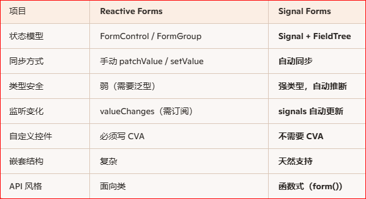
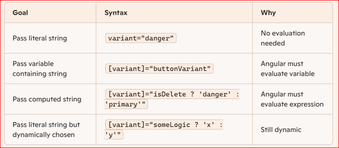
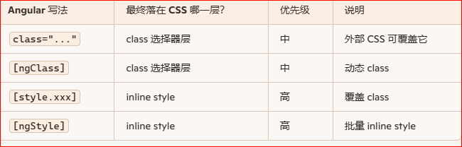

# angular
- parent pass string
- class ngclass style ngstyle 
- 5 case to use @HostListner
- signal form in 5 keys features
- xml to signals form
- model() model


## model 
```
model is a writable signal; the signal object
model() reads the current form data; 
model.set() updates it.
model.update(fn) → update based on previous value

model() 是一个 signal，保存整个表单的数据。
用 model() 读取，用 model.set() 更新。
Group 会自动同步到 model。
Array 必须手动更新，因为 Signal Form 不支持动态数组 FieldTree

model() is a signal that stores the current form’s data object.  
You read it with model() and update it with model.set(...)

Where does model() come from?
In your code, you create the form like this:

ts
form = signalFormGroup(schema, initialModel);
This returns an object that includes:

model → a signal holding the form’s data

formTree → the structure of all fields

submit → submit handler


ts
const { model, formTree } = form(...);
Now:

model is a signal

model() returns the current value

model.set(...) updates it

// returns the entire form model object
model() = {
  items: []
}

// save
const arr = model().items;
arr[index] = editedItem;
model.set({ ...model(), items: arr });


//model()?.[arr.name]
model()?.[arr.name]

model is a signal.

Signals are functions:

- model() → read the value

- model.set(v) → write the value

- model.update(fn) → update based on previous value


```

## xml to signals form

```
最小但完整的企业级结构：Schema + Parser + Builder + Component + Template。

1. 假设的 XML（动态表单定义）
xml
<form>
  <field name="email" type="string" required="true" />
  <field name="age" type="number" min="18" />
  <group name="address">
    <field name="city" type="string" required="true" />
    <field name="zip" type="string" />
  </group>
</form>
2. 定义 Schema 类型（TS）
ts
// form-schema.model.ts
export type FieldType = 'string' | 'number' | 'boolean';

export interface FormFieldSchema {
  name: string;
  type: FieldType;
  required?: boolean;
  min?: number;
  max?: number;
  pattern?: string;
}

export interface FormGroupSchema {  表示 一个对象（Object）
  name: string;
  field?: FormFieldSchema[];
  group?: FormGroupSchema[];
} 
formTree.groupname.fieldname().value() 

type: 'group' | 'array'
alternation: array
export interface FormArraySchema {
  type: array
  name: string;
  field?: FormFieldSchema[];
  group?: FormGroupSchema[];
}
if (schema.type === 'array') renderArray(schema);

//FormGroup = { name: string, age: number }
// FormArray = { items: Array<{ name: string, age: number }> }

export interface RootFormSchema {
  field?: FormFieldSchema[];
  group?: FormGroupSchema[];
}

alter to array
export interface RootFormSchema {
  field?: FormFieldSchema[];
  group?: FormGroupSchema[];
  array?: FormArraySchema[];
}

3. XML → Schema（xml2js 解析 + 归一化）

npm install xml2js

xml2js 的输出结构（非常重要）
xml2js 会把：

xml
<form>
  <field name="email" type="string" required="true" />
  <field name="age" type="number" min="18" />
</form>
解析成：

js
{
  form: {
    field: [
      { $: { name: 'email', type: 'string', required: 'true' } },
      { $: { name: 'age', type: 'number', min: '18' } }
    ]
  }
}
注意：所有 XML 属性会放在 $ 里  
这是 xml2js 的标准行为（官方文档说明属性会放在 $

ts
// xml-form-schema.parser.ts
import { Injectable } from '@angular/core';
import { Parser } from 'xml2js';
import { RootFormSchema, FormGroupSchema, FormFieldSchema } from './form-schema.model';

@Injectable({ providedIn: 'root' })
export class XmlFormSchemaParser {
  const parser = new Parser();
  parse(xml: string): Promise<RootFormSchema> {
    return new Promise((resolve, reject) => {
      parser.parseString(xml, (err, result) => {
        if (err) return reject(err);
        try {
          resolve(this.normalize(result));
        } catch (e) {
          reject(e);
        }
      });
    });
  }

如何把 xml2js 的结果转成你需要的 Schema
  private normalize(xmlObj: any): RootFormSchema {
    const form = xmlObj.form ?? {};
    return {
      field: this.normalizeFields(form.field),
      group: this.normalizeGroups(form.group),
      //alter to array
      array: this.normalizeArrays(form.array),
    };
  }

alter to array
private normalizeArrays(nodes: any[] | undefined): FormArraySchema[] {
  if (!nodes) return [];
  return nodes.map((a) => {
    const attr = a.$ || {};
    return {
      name: attr.name,
      field: this.normalizeFields(a.field),
      group: this.normalizeGroups(a.group),
    };
  });
}


你需要把 $ 属性提取出来
  private normalizeFields(nodes: any[] | undefined): FormFieldSchema[] {
    if (!nodes) return [];
    return nodes.map((n) => {
      const a = n.$ || {};
      return {
        name: a.name,
        type: (a.type ?? 'string') as any,
        required: a.required === 'true',
        min: a.min !== undefined ? Number(a.min) : undefined,
        max: a.max !== undefined ? Number(a.max) : undefined,
        pattern: a.pattern,
      };
    });
  }

  private normalizeGroups(nodes: any[] | undefined): FormGroupSchema[] {
    if (!nodes) return [];
    return nodes.map((g) => {
      const a = g.$ || {};
      return {
        name: a.name,
        field: this.normalizeFields(g.field),
        group: this.normalizeGroups(g.group),
      };
    });
  }
}
4. Schema → Signal Form Model + FieldTree（核心 Builder）
这里用的是实验性的 form() + signals API，假设你已在项目里启用 Signal Form。

ts
// signal-form.builder.ts
import { Injectable, signal } from '@angular/core';
import { form, required, min } from '@angular/forms'; // 按你实际导入路径调整
import { RootFormSchema, FormGroupSchema, FormFieldSchema } from './form-schema.model';

@Injectable({ providedIn: 'root' })
export class SignalFormBuilder {
  buildFromSchema(schema: RootFormSchema) {
    const modelSignal = signal(this.buildModel(schema));
    const formTree = form(modelSignal);

    this.applyAllValidators(formTree, schema);

    return { model: modelSignal, formTree };
  }

  // ---------- Model 构建 ----------

private buildModel(schema: RootFormSchema): any {
  const model: any = {};

  // 普通字段
  (schema.field ?? []).forEach(f => {
    model[f.name] = this.defaultValue(f.type);
  });

  // group
  (schema.group ?? []).forEach(g => {
    model[g.name] = this.buildGroupModel(g);
  });

  // array
  (schema.array ?? []).forEach(a => {
    model[a.name] = []; // 数组初始为空
  });

  return model;
}


  private buildGroupModel(group: FormGroupSchema): any {
    const m: any = {};

    (group.field ?? []).forEach((f) => {
      m[f.name] = this.defaultValue(f.type);
    });

    (group.group ?? []).forEach((g) => {
      m[g.name] = this.buildGroupModel(g);
    });

    return m;
  }

  private defaultValue(type: string) {
    switch (type) {
      case 'number': return 0;
      case 'boolean': return false;
      case 'string':
      default: return '';
    }
}

    4.2 添加数组项（用于 AppModal）
  addArrayItem(tree: any, arraySchema: FormArraySchema) {
  const newItem: any = {};

  (arraySchema.field ?? []).forEach(f => {
    newItem[f.name] = this.defaultValue(f.type);
  });

  (arraySchema.group ?? []).forEach(g => {
    newItem[g.name] = this.buildGroupModel(g);
  });

  // push
  tree.value.update((arr: any[]) => [...arr, newItem]);
}

  

  // ---------- Validators 应用 ----------

  private applyAllValidators(tree: any, schema: RootFormSchema | FormGroupSchema) {
    (schema.field ?? []).forEach((f) => {
      this.applyFieldValidators(tree[f.name](), f);
    });

    (schema.group ?? []).forEach((g) => {
      this.applyAllValidators(tree[g.name], g);
    });
  }

  private applyFieldValidators(fieldTree: any, schemaField: FormFieldSchema) {
    const validators: any[] = [];

    if (schemaField.required) validators.push(required());
    if (schemaField.min !== undefined) validators.push(min(schemaField.min));
    // 这里可以继续扩展 max / pattern 等

    fieldTree.validators.set(validators);
  }
}
5. 动态表单组件（加载 XML → 生成 Signal Form）
ts
// dynamic-signal-form.component.ts
import { Component, computed, effect, inject, signal } from '@angular/core';
import { XmlFormSchemaParser } from './xml-form-schema.parser';
import { SignalFormBuilder } from './signal-form.builder';
import { RootFormSchema } from './form-schema.model';

@Component({
  selector: 'app-dynamic-signal-form',
  templateUrl: './dynamic-signal-form.component.html',
})
export class DynamicSignalFormComponent {
  private parser = inject(XmlFormSchemaParser);
  private builder = inject(SignalFormBuilder);

  schema = signal<RootFormSchema | null>(null);
  model = signal<any | null>(null);
  formTree = signal<any | null>(null);

  // 示例：你可以从 API / 文件加载 XML
  private xmlSource = `
    <form>
      <field name="email" type="string" required="true" />
      <field name="age" type="number" min="18" />
      <group name="address">
        <field name="city" type="string" required="true" />
        <field name="zip" type="string" />
      </group>
    </form>
  `;

  constructor() {
    this.init();
  }

  async init() {
    const schema = await this.parser.parse(this.xmlSource);
    this.schema.set(schema);

    const { model, formTree } = this.builder.buildFromSchema(schema);
    this.model.set(model);
    this.formTree.set(formTree);

    // 观察模型变化（调试用）
    // model() is a signal that stores the current form’s data object.  
You read it with model() and update it with model.set(...)
    effect(() => {
      const m = this.model();
      if (m) console.log('Form model changed:', m);
    });
  }

  onSubmit() {
    console.log('Submit:', this.model()?.());
  }

  openArrayItemModal(arrSchema: FormArraySchema, rowIndex: number) {
  const arrayName = arrSchema.name;
  const item = this.model()?.()[arrayName][rowIndex];

  this.editingArray = {
    schema: arrSchema,
    index: rowIndex,
    model: signal(structuredClone(item)),
    formTree: form(signal(structuredClone(item)))
  };

  this.showModal.set(true);
}

8. 保存数组项回主表单
ts
saveArrayItem() {
  const arrName = this.editingArray.schema.name;
  const index = this.editingArray.index;

  const updated = this.editingArray.model();

  this.model().value.update((m: any) => {
    const arr = [...m[arrName]];
    arr[index] = updated;
    return { ...m, [arrName]: arr };
  });

  this.showModal.set(false);
}

}


6. 动态模板（根据 Schema 渲染 UI）
html
<!-- dynamic-signal-form.component.html -->

<form *ngIf="schema() && formTree()" (ngSubmit)="onSubmit()">

 alter to array
 <!-- 渲染 array --> 数组项不能直接用 [formField]，因为数组项是动态的 
<ng-container *ngFor="let arr of schema()!.array">
  <h3>{{ arr.name }}</h3>

  <app-table  Angular Signal Form 不支持自动生成数组 FieldTree
    [columns]="arr.field!.map(f => f.name)" 
    [rows]="model()?.()[arr.name]" 点击 row → 打开 Modal  在 Modal 中创建 sub-form manually 保存后写回主 model
    (rowClicked)="openArrayItemModal(arr, $event)" 
  ></app-table>

  <app-button
    variant="primary"
    (clicked)="addArrayItem(arr)"
  >
    Add {{ arr.name }}
  </app-button>
</ng-container>


  <!-- 顶层字段 -->
  <ng-container *ngFor="let f of schema()!.field">
    <div>
      <label>{{ f.name }}</label>
      <input
        [type]="f.type === 'number' ? 'number' : 'text'"
        [formField]="formTree()[f.name]"
      />
    </div>
  </ng-container>

  <!-- group 字段 -->  直接递归渲染 read
  <ng-container *ngFor="let g of schema()!.group">
    <fieldset>
      <legend>{{ g.name }}</legend>

      <ng-container *ngFor="let f of g.field">
        <div>
          <label>{{ f.name }}</label>
          <input
            [type]="f.type === 'number' ? 'number' : 'text'"
            [formField]="formTree()[g.name][f.name]"
          />
        </div>
      </ng-container>
    </fieldset>
  </ng-container>

  <button type="submit">提交</button>
</form>

7  AppModal 组件模板应该包含：

html
<!-- app-modal.component.html -->
<div class="backdrop" *ngIf="open"></div>

<div class="modal" *ngIf="open">
  <header class="modal-header">
    <ng-content select="[modal-header]"></ng-content>
  </header>

  <section class="modal-body">
    <ng-content select="[modal-body]"></ng-content>
  </section>

  <footer class="modal-footer">
    <ng-content select="[modal-footer]"></ng-content>
  </footer>
</div>

8  app-modal.component.ts
import {
  Component,
  Input,
  Output,
  EventEmitter,
  HostListener,
  signal,
  effect,
  inject,
  ElementRef,
} from '@angular/core';

@Component({
  selector: 'app-modal',
  standalone: true,
  templateUrl: './app-modal.component.html',
  styleUrls: ['./app-modal.component.css'],
})
export class AppModalComponent {
  private host = inject(ElementRef);

  @Input({ required: true }) open = false;
  @Input() closeOnBackdrop = true;
  @Input() escToClose = true;

  @Output() closed = new EventEmitter<void>();

  private scrollLocked = signal(false);

  constructor() {
    effect(() => {
      if (this.open) this.lockScroll();
      else this.unlockScroll();
    });
  }

  // -----------------------------
  // ESC key close
  // -----------------------------
  @HostListener('document:keydown.escape')
  onEsc() {
    if (this.open && this.escToClose) {
      this.close();
    }
  }

  // -----------------------------
  // Backdrop click close
  // -----------------------------
  onBackdropClick(event: MouseEvent) {
    if (!this.closeOnBackdrop) return;

    const modal = this.host.nativeElement.querySelector('.modal');
    if (!modal.contains(event.target)) {
      this.close();
    }
  }

  // -----------------------------
  // Close modal
  // -----------------------------
  close() {
    this.closed.emit();
  }

  // -----------------------------
  // Scroll Lock
  // -----------------------------
  private lockScroll() {
    if (this.scrollLocked()) return;
    document.body.style.overflow = 'hidden';
    this.scrollLocked.set(true);
  }

  private unlockScroll() {
    if (!this.scrollLocked()) return;
    document.body.style.overflow = '';
    this.scrollLocked.set(false);
  }
}


9. usage of Modal 模板：动态渲染数组项字段 使用方式 at parent level
html
<app-modal
  [open]="showModal()"
  (closed)="showModal.set(false)"
>
  <h2 modal-header>Edit Item</h2>

  <div modal-body *ngIf="editingArray">
    <ng-container *ngFor="let f of editingArray.schema.field">
      <label>{{ f.name }}</label>
      <input
        [type]="f.type === 'number' ? 'number' : 'text'"
        [formField]="editingArray.formTree[f.name]"
      />
    </ng-container>
  </div>

  <div modal-footer>
    <app-button variant="primary" (clicked)="saveArrayItem()">Save</app-button>
  </div>
</app-modal>

html
<app-modal [open]="showModal()">
  <h2 modal-header>Edit Item</h2>

  <div modal-body>
    <input [formField]="editingArray.formTree.name" />
  </div>

  <div modal-footer>
    <app-button variant="primary">Save</app-button>
  </div>
</app-modal>


7. 你可以怎么扩展这套生成器
支持 FormArray：在 XML 中引入 <array name="items">，在 Schema + Builder 里加数组逻辑

支持更多控件类型：type="select" / "checkbox" / "date" → 在模板里用 ngSwitch 动态选择组件

支持布局信息：在 XML 中加 row/col/tab/step，在模板中递归渲染布局

支持复杂验证：pattern / maxLength / cross-field validator 都可以在 applyFieldValidators / group 级别扩展

```


## Signal Form 与 Reactive Form
```


- 没有 ControlValueAccessor（CVA）

- 表单状态 = Signals

- 表单模型（model）是唯一数据源

- UI 与模型自动同步

- 没有 FormControl / FormGroup / FormArray

- 没有 valueChanges 订阅

Signal Form 的核心概念（最重要 5 点）
1. Form Model（表单模型）= 一个 writable signal
ts
const loginModel = signal({
  email: '',
  password: ''
});
这个 signal 就是表单的真实数据源。
任何 UI 输入 → 自动更新这个 signal。

export class App {
  readonly model = signal({
    rating: 3
  });

  readonly ratingForm = form(this.model, f => {
    max(f.rating, 7);
  })
}

2. form(model) → 生成 FieldTree（字段树）
ts
const loginForm = form(loginModel);
FieldTree 会根据 model 的结构自动生成字段：

loginForm.email

loginForm.password

并且是 强类型 的。
访问不存在的字段会直接 TS 报错。

3. [formField] 指令实现双向绑定
html
<input type="email" [formField]="loginForm.email" />
效果：

输入框变化 → 自动更新 model

model 变化 → 自动更新 UI
无需 ngModel、无需 formControlName。

4. 读取字段状态：field()
ts
loginForm.email().value()   // 当前值
loginForm.email().valid()   // 是否有效
loginForm.email().touched() // 是否触碰
所有状态都是 signals，天然响应式。

5. 更新字段：value.set()
ts
loginForm.email().value.set('alice@wonderland.com');
这会同步更新：

字段状态

表单模型 signal

```

## how parent pass string

```
parent has: buttonVariant = 'danger';
child has: @Input() variant!: string;
usage: <app-button [variant]="buttonVariant"></app-button>



```

## 同时使用 class、ngClass、style、ngStyle

```


class（静态）

ngClass（动态 class）

style.xxx（单属性 inline style）

ngStyle（批量 inline style）

/* ngClass 动态 class */
.active-class {
  color: red;
  background: orange;
}

<div
  class="box static-class"
  [ngClass]="{ 'active-class': isActive, 'sdf':tru }"
  [style.color]="useInlineColor ? 'yellow' : null"
  [ngStyle]="useNgStyle ? { background: 'black', padding: '20px' } : null"
>
  Demo Box
</div>
<button (click)="toggleActive()">Toggle ngClass (active)</button>
<button (click)="toggleInlineColor()">Toggle [style.color]</button>
<button (click)="toggleNgStyle()">Toggle [ngStyle]</button>

<pre>
isActive: {{ isActive }}
useInlineColor: {{ useInlineColor }}
useNgStyle: {{ useNgStyle }}
</pre>

export class AppComponent {
  isActive = false;
  useInlineColor = false;
  useNgStyle = false;

  toggleActive() {
    this.isActive = !this.isActive;
  }

  toggleInlineColor() {
    this.useInlineColor = !this.useInlineColor;
  }

  toggleNgStyle() {
    this.useNgStyle = !this.useNgStyle;
  }

```

## @HostListener

```
为什么要用 @HostListener，而不是 HTML 的 (click)？
✔ 1) 组件内部行为（不暴露给外部）
如果你不想让父组件看到 click，只想组件内部处理：

ts
@HostListener('click')
onClick() { ... }
✔ 2) 自定义组件行为（比如 ripple 效果）
AppButton 就是这样：

ts
@HostListener('click', ['$event'])
createRipple(event: MouseEvent) { ... }
$event 就是原生 DOM 的 MouseEvent
这样 ripple 效果自动触发，不需要在 HTML 写 (click)="..."

✔ 3) 指令（Directive）必须用 HostListener
比如：

ts
@Directive({ selector: '[appAutoFocus]' })
export class AutoFocusDirective {
  @HostListener('click')
  onClick() {
    console.log('元素被点击');
  }
}
指令没有 template，所以必须用 HostListener。

🟦 真实复杂场景（AppButton ripple 效果）
你之前的 AppButton ripple 就是这样：

ts
@HostListener('click', ['$event'])
onClick(event: MouseEvent) {
  if (this.disabled || this.loading) {
    event.preventDefault();
    event.stopImmediatePropagation();
    return;
  }

  this.createRipple(event); //do ripple first 因为 ripple 是 视觉反馈，clicked 是 业务事件
  this.clicked.emit(event);
}
解释：

用户点击按钮

HostListener 捕获 click

如果 disabled/loading → 阻止点击

否则 → 先做 ripple，再 emit clicked

这是 企业级按钮组件的标准写法。

因为 HTML 的 disabled 只会阻止原生 click，但不会阻止 Angular 的事件冒泡。
所以 loading 时必须手动阻止点击，否则会出现：

用户疯狂点击

重复提交

重复 API 调用

重复触发事件

ripple 效果乱飞

UI 卡顿

按钮被禁用或加载中 → 不让点（防止乱点）
按钮正常 → 先给用户视觉反馈（ripple）
再执行业务逻辑（emit clicked）
这样按钮才稳、好用、不会出 bug

```

 

## Angular 里一共有 5 种方式可以阻止默认行为（preventDefault）in HTML or TS
```
而且每一种都有不同的使用场景。
我会按从“最常用”到“最底层”排序，让你一眼就能选对。

🟦 方式 1：在模板里直接用 $event.preventDefault()（最常用）
html
<button (click)="onClick($event); $event.preventDefault()">
  Save
</button>
或更简洁：

html
<button (click)="$event.preventDefault()">
适用场景
简单阻止默认行为

不需要复杂逻辑

不需要在 TS 里处理

🟦 方式 2：在组件方法里调用 event.preventDefault()（最标准）
ts
onClick(event: MouseEvent) {
  event.preventDefault();
}
 
适用场景
组件内部逻辑
 
Shared UI 组件（AppButton）

需要同时阻止冒泡、阻止默认行为

🟦 方式 3：使用 @HostListener 捕获事件并阻止默认行为（企业级组件常用）
ts
@HostListener('click', ['$event'])
onHostClick(event: MouseEvent) {
  event.preventDefault();
}
适用场景
自定义组件（AppButton、AppModal）

指令（Directive）

不想在模板写 (click)

想封装内部行为（ripple、loading、disabled）

这是你 AppButton 用的方式。

🟦 方式 4：在模板里使用 Angular 的 $event 修饰符（最简洁）
Angular 支持：

html
<form (submit)="onSubmit(); $event.preventDefault()">
但 Angular 没有 Vue 那种 .prevent 修饰符，
所以必须写 $event.preventDefault()。

适用场景
表单 submit

链接 click

简单阻止默认行为

🟦 方式 5：使用 return false（老方法，不推荐，但仍然有效）
html
<button (click)="onClick(); return false">
Angular 会把 return false 视为：

event.preventDefault()

event.stopPropagation()

适用场景
兼容旧代码

快速阻止所有行为

但不推荐在新项目使用。

🟦 方式 6：在指令中使用 Renderer2（底层方式）
ts
constructor(private renderer: Renderer2, private el: ElementRef) {
  this.renderer.listen(this.el.nativeElement, 'click', (event) => {
    event.preventDefault();
  });
}
适用场景
自定义指令

需要在运行时动态绑定事件

需要兼容 SSR / WebWorker

🟦 方式 7：使用事件捕获阶段阻止默认行为（高级场景）
ts
@HostListener('document:click', ['$event'])
onDocClick(event: MouseEvent) {
  if (shouldBlock(event)) {
    event.preventDefault();
  }
}
适用场景
全局事件控制

用于 Modal、Dropdown、Overlay 等全局交互

监听 document 级别事件 但它们不是默认捕获阶段 
监听整个网页的事件，然后组件内部决定要不要处理

Angular 的 HostListener 默认监听的是冒泡阶段（bubble phase）

onEsc() 用的是 @HostListener('document:keydown.escape')，
onDocClick() 用 @HostListener('document:click')

默认情况下：

浏览器事件顺序是：
捕获 → 目标 → 冒泡

Angular 默认监听 冒泡阶段。

但你可以让 Angular 监听 捕获阶段：

ts
@HostListener('document:click.capture', ['$event'])
onDocClick(event: MouseEvent) {
  event.preventDefault();
}
注意 .capture：

.capture = 捕获阶段

.passive = 被动监听

.once = 只触发一次

这是 Angular 的高级 HostListener 特性。

```


## 🟦 HostListener 的 7 大高级用法（完整版）
```

1) 监听 DOM 事件（基础但最常用）
ts
@HostListener('click', ['$event'])
onClick(event: MouseEvent) { ... }
监听组件本身的事件

$event 是原生事件对象

AppButton ripple 就是用这个

2) 监听 document 事件（全局事件）
ts
@HostListener('document:keydown.escape')
onEsc() { ... }
不管焦点在哪

ESC 一按就触发

Modal、Dropdown、Overlay 必备

3) 监听 window 事件（窗口级别）
ts
@HostListener('window:resize', ['$event'])
onResize(event: UIEvent) { ... }
响应式布局

监听滚动、大小变化

图表、布局组件常用

4) 使用事件修饰符（capture / passive / once）——真正高级
Angular 支持：

✔ 捕获阶段（事件最早触发）
ts
@HostListener('document:click.capture', ['$event'])
onDocClick(event: MouseEvent) { ... }
用途：

Modal loading 时锁定全局点击

阻止外部库事件

阻止所有点击（安全模式）

✔ passive（告诉浏览器“我不会阻止默认行为”）
ts
@HostListener('window:scroll.passive', ['$event'])
onScroll(event: Event) { ... }
用途：

性能优化（scroll/touch）

避免浏览器警告

✔ once（只触发一次）
ts
@HostListener('document:click.once', ['$event'])
onFirstClick(event: MouseEvent) { ... }
用途：

第一次点击触发某个逻辑

新手引导（onboarding）

只监听一次的事件

5) 同时监听多个事件（多 HostListener）
ts
@HostListener('window:resize')
@HostListener('window:orientationchange')
onLayoutChange() { ... }
用途：

移动端布局

图表自适应

Modal/Drawer 自适应

6) 监听自定义事件（组件内部 dispatchEvent）
ts
@HostListener('myCustomEvent', ['$event'])
onCustom(e: CustomEvent) { ... }
配合：

ts
this.el.nativeElement.dispatchEvent(new CustomEvent('myCustomEvent'));
用途：

自定义组件内部通信

指令与组件交互

7) 阻止默认行为 + 阻止冒泡（企业级组件必备）
AppButton 的黄金写法：

ts
@HostListener('click', ['$event'])
onClick(event: MouseEvent) {
  if (this.disabled || this.loading) {
    event.preventDefault();
    event.stopImmediatePropagation();
    return;
  }

  this.createRipple(event);
  this.clicked.emit(event);
}
用途：

防止重复提交

防止 loading 时点击

ripple 不被打断

业务逻辑安全

🟦 HostListener 所有语法（完整版表格）
写法	说明	场景
'click'	监听组件自身事件	AppButton
'document:click'	监听全局事件	Modal、Dropdown
'window:resize'	监听窗口事件	响应式布局
'document:click.capture'	捕获阶段	全局点击锁定
'window:scroll.passive'	被动监听	性能优化
'document:keydown.escape'	ESC 关闭	Modal
'document:click.once'	只触发一次	Onboarding
'myEvent'	自定义事件	指令/组件通信


```