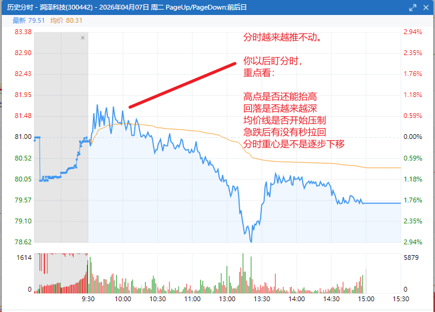

润泽科技
胜宏科技
法本信息
航天发展
托普云农

A类（主升真龙 / 真妖预备）
这些是你现在最该盯“资金语言”的。

润泽科技（300442）
评分：9.4/10
体系：α - AI算力 / 数据中心 / 周线压缩突破体系
操作：只做回踩，不追高。
这是典型：

AI主线

高换手后没死

15分钟沿MA5

分时重心长期抬高

大阳后横住

你看它：
不是暴冲，
而是：

拉一段 → 横住 → 再抬高

这是主力控节奏。
最关键：
它没有明显兑现欲望
这才是真强。
如果后面：

缩量横住

回踩不破MA5

尾盘继续抢筹

容易进入二波主升。

胜宏科技（300476）
评分：9.5/10
体系：α - AI硬件/CPO核心趋势体系
操作：强趋势股，等15分钟缩量回踩。
这是非常强的：

AI硬件核心

趋势持续

量价结构健康

资金锁仓明显

而且：
分时非常“稳”
真正的大资金票：
不是上下乱甩，
而是：

慢慢推、慢慢抬高。

这种票：

很少给舒服买点

一旦回踩

很容易被资金抢回去

现在属于：

“主升途中，不是结束。”

航天发展（000547）
评分：9.2/10
体系：β - 商业航天 / 情绪主升体系
操作：看是否能高位横住。
这是今天明显的：

板块共振

情绪点火

前排涨停

但它和润泽/胜宏不同：
它更偏：

情绪加速板。

所以核心不是今天涨停，
而是：
明天炸不炸
真正强：

炸板后能回封

或高位横住不跳水

如果：

高开低走

放量大阴

跌破分时均线后收不回

那就是情绪套利。

B类（有结构，但还没完全确认）

法本信息（300925）
评分：8.8/10
体系：α - AI软件二波预备体系
操作：重点观察“缩量不跌”。
它最有价值的是：

高换手之后没崩。

而且你之前已经注意到它：

MA5托举

攻击型压缩

阴线越来越弱

分时逐渐稳

这是典型：

二波前夜特征。

现在缺什么？
缺：
一根真正放量突破阳线
如果后面：

AI板块继续回暖

它先于板块走强

尾盘抢筹

就容易成为：

AI软件二波龙。

托普云农（301556）
评分：8.6/10
体系：α - AI应用/高弹性趋势体系
操作：观察是否继续沿15分钟MA5。
这个尾盘明显有资金点火。
重点看：

明天是否继续高举高打

还是冲高回落

真正强势：
不是尾盘偷拉，
而是：

第二天还能承接。

C类（暂时偏弱 / 跟风）

工业富联（601138）
评分：7.2/10
体系：β - AI权重趋势体系
操作：更适合指数行情，不适合妖股节奏。
它的问题：

太大

太机构

弹性不足

现在市场偏：

小票高弹性妖股风格。

所以它最近明显弱于：

润泽

胜宏

法本

你这个池子里现在最值得观察的核心
按“主力资金语言”排序：

润泽科技

胜宏科技

法本信息

航天发展

托普云农

现在真正重要的不是“谁涨最多”
而是：
谁符合：

放量后横住

缩量不跌

MA5托举

回踩越来越浅

分时越来越稳

尾盘抢筹

高换手但不崩

因为：

真正突破前，
往往不是买盘越来越猛，
而是卖盘越来越少。
