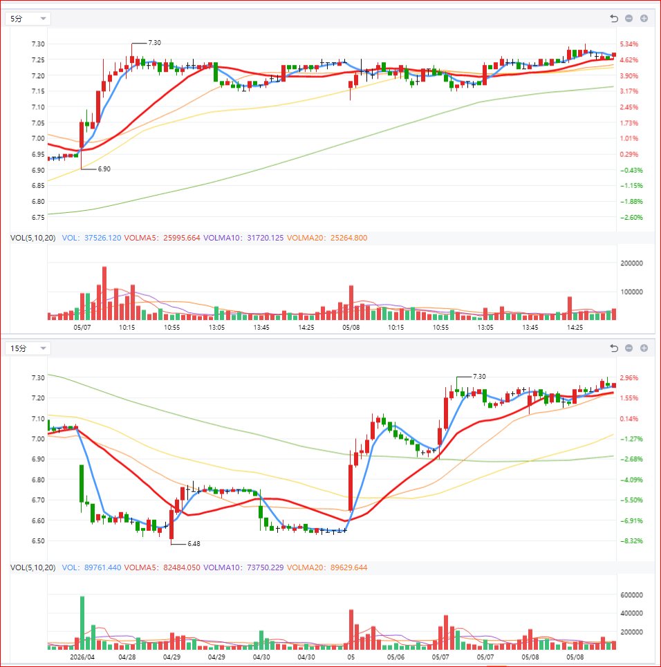

## 主线
- AI
- 算力
- 数据中心
- 机器人
- 商业航天
- 券商并购

## 分时核心框架 checklists

- 主力当天到底在干什么
    - 谁在主动
    - 谁在撤退
    - 有没有承接
    - 是吸筹还是派发
    - 是洗盘还是出货

- 分时信号
| 分时衰弱信号    | 价格表现      | 成交量表现  | 资金语言         | 强势/弱势判断 | 操作理解       |
| --------- | --------- | ------ | ------------ | ------- | ---------- |
| 高点抬不高     | 一波高点低于一波  | 量缩     | 追价资金减少，但抛压不大 | 中性偏弱    | 观察是否重新放量突破 |
| 高点抬不高     | 一波高点低于一波  | **放量**     | 高位有人边拉边卖     | **弱**      | 小心出货       |
| 回落越来越深    | 跌幅扩大      | 缩量     | 正常震荡/洗盘      | 中性      | 看是否能快速修复   |
| 回落越来越深    | 跌幅扩大      | **放量**     | 主动卖压增强       | **弱**       | 容易继续下杀     |
| 分时重心下移    | 每轮震荡更低    | 缩量     | 资金观望         | 中性偏弱    | 等方向选择      |
| 分时重心下移    | 每轮震荡更低    | **放量**     | 大资金撤退        | **很弱**      | 小心A杀       |
| 15分钟沿MA5  | 回踩即收回     | 缩量回踩   | 主力控节奏        | 强       | 主升进行中      |
| 15分钟跌破MA5 | 多次收不回     | 跌时**放量 **  | 控盘减弱         | **弱**       | 进入调整期      |
| 下跌放量 反弹缩量 | 跌时量大 弹时量小 | 恶化量价   | 人人想跑         | **弱**       | 反弹多是卖点     |
| 尾盘跳水      | 尾盘持续走低    | 尾盘放量   | 资金抢跑         | 弱       | 次日承压       |
| 攻击型压缩     | 横盘但低点抬高   | 量逐渐缩   | 卖压衰竭         | 极强      | 突破概率高      |
| 高换手后不跌    | 巨量后横住     | 量能逐渐稳定 | 强资金锁仓        | 极强      | 二波/妖股前夜    |
| 放量突破后横住   | 大阳后不回吐    | 缩量整理   | 主力控盘         | 极强      | 最值钱结构      |
| 尾盘抢筹      | 尾盘拉升收高    | 尾盘放量   | 资金抢先手        | 强       | 次日容易高开     |
| 上涨放量 下跌缩量 | 拉升有量 回踩无量 | 健康量价   | 主动买盘强        | 强       | 主升常见       |
| 分时重心抬高    | 横盘位置越来越高  | 缩量     | 锁仓增强         | 强       | 主升结构       |
| 阴线越来越弱    | 阴线实体缩小    | 量缩     | 空头衰竭         | 强       | 容易酝酿突破     |
| 均价线开始压制   | 反抽不过均价线   | 反抽无量   | 买盘衰退         | 弱       | 日内转弱确认     |
| 均价线开始压制   | 放量突破均价线   | **放量**     | 有资金夺回主动权     | **转强**观察    | 看能否站稳      |
| 急跌后秒拉回    | 长下影快速修复   | **放量承接**   | 主力主动维护       | **强**       | 往往是洗盘      |
| 急跌后横着磨    | 跌后无修复     | 缩量     | 没资金愿接        | 弱       | 容易阴跌       |

- 出现异常大阴 **先减仓 因为：真强股不该这样跌**
    - 看第二天有没有修复 如果：快速收回 缩量止跌 回MA5 可以接回来。
    - 第三阶段：如果继续弱 直接认错。因为：真龙不会长期弱。
    - 强股最重要的特征：“弱得很短” 如果： 弱了很多天 MA5持续压制 没有资金修复 那通常已经不是洗盘。
    - **以后你看到大阴 不要先问：“是不是到底了？”而是先问：“它为什么突然不强了？”**
        - 股价是结果，资金态度才是原因
        - 主线切换了
        - 主力不想继续做了 
        - 15分钟 拉不动了 主力开始惜拉
            - 冲高后回落变深
            - 新高越来越难
            - 红K实体缩小
            - 阳线越来越短
            - 横盘越来越久
        - MA5
        - 尾盘
        - 承接 放量以后还能不能继续涨
        - 高点结构
        - 分时重心

`不是不跌，而是：“跌下去马上有人接” `

- ① 急跌有没有承接
    - 真承接: 很快：跌速变慢 出现连续小买单 出现大单托 价格被拉回 回到均价附近
            成交量大not matter, 
            - 急跌
            - → 很快稳
            - → 缩量横
            - → 慢慢拉回
            - MA5重新跟上
            - 阴线越来越弱
            - 回踩越来越浅
            - 新低越来越难
            - 波动越来越窄
            - 后面几乎横住
    - 假承接: 有大买单托 但价格还是慢慢阴跌 托单不断撤 拉不回均价 
            只是护盘，不是真承接
            - 急跌
            - → 继续跌 **`depth`**
            - → 没承接 **`support`**
            - → 越跌越快 **`speed`**
            - 越跌越放量 **volume**
            - 拉回不了MA5
            - 低点不断新低
    - 最核心看：
        - 15分钟 + 分时  
            - 急跌后：下一根/两根15分钟：很快止跌 不是继续瀑布
            - 下影开始出现 说明：下面有人接。
            - 成交量放大但跌不深 超级重要。说明：大量筹码被承接
            - 很快重新站回MA5 这很关键。 说明：空头压制失败。
            - 后续低点不再创新低 说明：卖压开始衰竭(很多时候不是“拉起来”而是：“不继续跌了)

            - 分时是：观察“瞬间行为” 
                - 例如：急跌时：看：
                - 是否立刻有连续买单
                - 是否迅速缩量
                - 是否V拉
                - 是否回均价
            - 但：真正是否成立：
                - 还是要看15分钟
                - 能不能稳住
        - 5分钟：太容易假
        - 连续两根15分钟仍然更低
            - 跌速有没有减缓（最重要）第三根继续放量 -> 真正崩。
            - 下跌越来越放量 恐慌还在继续
            - 看是否跌破关键结构
            - 低点开始稳定。 or 低点连续降低
        - 尾盘继续砸
        - 分时回不到均价

- ② 是否运行在均价线上
- ③ 回踩是否越来越浅
- ④ 分时重心是否抬高
- ⑤ 尾盘有没有资金抢
- ⑥ 放量后有没有崩

## 真正突破前最值钱的信号 四大核心维度
### 一、卖压衰竭（最核心）
| 信号       | 含义       |
| -------- | -------- |
|真正终极信号 | 这票怎么就是跌不下去 几乎横住 波动越来越窄
|急跌消失 | 很难出现连续急跌 因为都会立刻被接回 下面已经有人守
|放量后横住 | 以15分钟和日线为主，5分钟只做辅助。
|冲高回落越来越浅 | 抛压减弱
|分时重心不断抬高| 
|长上影开始减少 | 惜售增强
|下影越来越短 | 冲高回落越来越浅
|阴线越来越弱 | 空头衰竭 

### 二、主力控盘增强（高级）
| 信号       | 含义       |
| -------- | -------- |
| MA5托举	 | 控节奏推进
| 15分钟沿MA5	 | 中级别控盘
| 盘口越来越“轻”  |  很小买单 就能推上去
| 横盘时间开始“熬人”  | 低关注度下完成锁仓
| 涨速开始“变慢”  | 故意压节奏
| 回踩越来越浅  | 不愿给低吸

### 三、锁仓完成（主升前夜）
| 信号       | 含义       |
| -------- | -------- |
| 横盘熬人    | 清理不坚定筹码 |
| 低关注度    | 主力低调锁仓  |
| 板块退潮仍维护 | 核心资金未撤  |
| 不跟大盘跌   | 主力惜筹    |
| 假阴线     | 边洗边锁    |
| 攻击型压缩   | 弹簧压缩    |

### 四、突破前最后确认（临门一脚）突然：假摔 急跌 恐慌 很快被拉回
| 信号       | 含义       |
| -------- | -------- |
| `分时重心不断抬高` | 主动抬成本    |
| `尾盘抢筹 `    | 怕明天买不到   |
| 最后一次洗盘   | 清最后浮筹    |
| 炸板后二次发动  | 真资金仍在    |
| `放量后横住`    | 市场认可新价格区 |

### checklist 放量后横住 15分钟
| 信号       | 是否存在 |
| -------- | ---- |
| 放量攻击     | ✔    |
| 放量后横住    | ✔    |
| MA5托举    | ✔    |
| 假阴线      | ✔    |
| 阴线衰竭     | ✔    |
| 攻击型压缩    | ✔    |
| 低点抬高     | ✔    |
| 15分钟沿MA5 | ✔    |

### checklist 放量后横住 日线
真强：大阳后：

- 不跌回去
- 小阴小阳横
- MA5跟上

真弱：大阳后：

- 第二天跌回
- 吞没
- 放量阴跌

## 主力行为语言
`建仓 洗盘 锁仓 试盘 控节奏 拉升 派发 而这些动作：都会在：
K线 成交量 分时 MA 涨跌节奏 里留下痕迹。`
### 主力现在处于哪个阶段

| UI / 结构语言 | 主力行为   | 真正含义      |
| --------- | ------ | --------- |
| 缩量不跌      | 锁仓完成   | 卖盘越来越少    |
| MA5托举     | 控节奏推进  | 不给舒服低吸    |
| 攻击型压缩     | 边洗边锁   | 浮筹失去耐心    |
| 高换手但不崩    | 大规模承接  | 高位持续收筹    |
| 假阴线 / 假摔  | 洗浮筹    | 清理不坚定资金   |
| 尾盘抢筹      | 抢先锁仓   | 怕明天更贵     |
| 炸板后二次发动   | 主动换手   | 真资金仍在     |
| 放量后横住     | 强承接确认  | 市场认可新价格区  |
| 低点不断抬高    | 主动抬成本  | 资金愿意越来越高接 |
| 阴线越来越弱    | 空头衰竭   | 卖压越来越小    |
| 回踩越来越浅    | 控盘增强   | 主力不愿深调    |
| 15分钟沿MA5  | 持续控节奏  | 主力稳定推进    |
| 周线压缩后首次放量 | 中大资金建仓 | 长周期启动     |
| 高位横盘不A杀   | 锁仓成功   | 主升可能未结束   |
| 缩量假阴连续出现  | 边洗边控   | 主升前夜常见    |
| 涨停后不回吐    | 强势锁价   | 主力不愿丢筹码   |
| 分时黄线强于白线  | 赚钱效应扩散 | 市场跟随增强    |
| 尾盘收最高附近   | 隔夜惜售   | 持筹信心增强    |
| 板块共振      | 主线确认   | 增量资金持续进入  |

### 主力阶段
| 行为     | 主力阶段 |
| ------ | ---- |
| 周线压缩   | 潜伏   |
| 缩量不跌   | 锁仓   |
| 假阴线    | 洗盘   |
| 放量横住   | 承接   |
| MA5推进  | 控盘   |
| 尾盘抢筹   | 提前发动 |
| 连板加速   | 主升   |
| 高位爆量滞涨 | 派发   |

## 真正突破前资金行为语言
- 资金已经在里面控结构了
- 放量后是否横住
- 不要只看K线颜色, but its effects: 跌得深不深 收盘是否收回 是否跌破- 阴线后第二天是否修复 成交量是否缩小
- 卖压衰竭（最核心) 很多时候不是“拉起来” 而是：“不继续跌了 
- 价格重心持续抬高（超级重要）
- 波动收窄（攻击型压缩）(越来越“安静”) 
- 放量后“不回吐” (资金认可这个价格区)
- MA5越来越“贴身” (主力不愿意给深调低吸)
- 假阴线增多（很重要 小阴 假阴 十字星）
- 炸板后修复能力（高级理解）
- 尾盘越来越强（超级真实）
- 15分钟级别越来越顺（回踩越来越浅）
- 量价关系开始“反常” (缩量 → 应该跌)
- 突破前经常“不起眼” (觉得没意思)
- 真正突破前 (卖盘已经消失)

| 级别   | 本质             |
| ----   | ----------       |
| 5分钟  | 情绪/点火/短线行为 |
| 15分钟 | 持续资金行为       |
| 30分钟 | 主升结构         |
| 日线   | 主力级趋势      |
| 周线   | 中大资金布局     |

### 15日分时图真正怎么看

- 最强15日分时结构 拉一段 → 横一段 repeat
- 真正值钱的是：放量以后，价格还能长期稳在高位

| 重点看  | 本质             |
| ----   | ----------       |
|① 价格重心 | 是上移还是下移
|② 急跌后： | 能不能稳住
|③ 平台： | 是越来越高还是越来越低
|④ 波动： | 是越来越乱还是越来越稳
|⑤ 均价线：| 是否持续抬高
|⑥ 高位横盘：| 是锁仓还是派发

### 日线（方向）
- 是否主线
- 是否高位横住
- 是否缩量不跌

### 15分钟（核心）“有人在控”
- 是否沿MA5
- 是否低点抬高
- 是否攻击型压缩
- 是否假阴线

### 5分钟可以看？（辅助）
- ✔ 早盘异动
- ✔ 是否主动进攻 看5分钟沿MA5
- ✔ 点火
- ✔ 分时承接
- ✔ 回踩是否立刻拉回
- ✔ 尾盘抢筹

### 5 “有人在拉”  大周期稳定，
### 15 “有人在控” 小周期进攻。
### 日线：告诉你：“资金是否真正锁仓”

## A类：主升真龙 / 真妖预备（重点池）

`重点找：多个信号同时出现 主力已经准备发动 但市场还没完全发现`

- 主线共振
    - 板块有持续性：龙头会反复被资金做 跟风会轮动 回调有人接

    - 共振: 板块涨停扩散 龙头持续走强 板块指数同步上升 同方向多个票共振 `真` 龙头+中军+跟风一起动 连续多天有涨停 板块成交额放 大 高位票不崩

- 高换手但不崩 `真正强票核心中的核心`
    - 即使：20% 30% 巨量换手 仍然：横住 不大跌 
    - 普通票：放量后：大跌 A杀 套牢 因为：没人接筹码

- 沿MA5 MA5托举 
    - 主力不想给低吸机会 回踩浅 很快拉回 不深调
    - 回踩MA5立刻收回 连续贴MA5上涨 MA5持续向上
    - 弱: 跌破MA5后站不回 `MA5走平  回踩越来越深`
    - MA5其实是 `短线资金成本线` 

    - 5: 日内情绪
    - 15:短趋势控盘
    - day: 真正主升趋势

- 攻击型压缩 ` 妖股前夜`这个非常关键。
    - 普通横盘：`死横 没有攻击性。`
    - 攻击型压缩：`弹簧被压缩 边锁仓边洗人` 表面像调整
    - 特点：
        - 低点不断抬高 没跌多少 很快收回
        - 高点始终不远
        - 高低点收敛
        - 阴线越来越短
        - K线变短
        - 振幅变小

        - 波动越来越小
        - 量逐渐缩
        - 上下影减少
 
- 缩量不跌 `最关键资金语言`
    - 弱票：缩量 = 没人买 所以：会阴跌
    - 强票：`缩量后：不跌 横住 甚至慢慢抬高`

    - 真正的突破前：很多时候：`不是买盘突然变猛，而是卖盘先消失` 这是顶级理解。

    - 5: 可能只是：没人交易
    - 15:锁仓意味
    - 日:含金量最高

- 弱阴线
    - `阴线的“杀伤力” 越来越小` 不是阴线数量减少
    - 已经砸不动 `实体越来越短 下跌越来越浅 很快被收回 不离开MA5`
    - 真阴线：`一根比一根长 收盘越来越低 跌破MA5 回抽无力`
    - 不是：所有缩量都强 而是： “强攻击后的缩量 大趋势整体趋势反转M5/M20/M10” 才是真正值钱

    - 5分钟假阴：意义不大。
    - 15分钟假阴：开始有价值
    - 日线假阴：非常关键 代表全天资金结构。

- 15分钟沿MA5推 `主力在“控节奏”`
    - 15分钟级别，含金量明显更高。因为：`周期越大，越不容易被“骗线”。15分钟已经不是小游资能轻易控制的。` 
    - 5分钟级别 常见于：日内资金点火 情绪拉升 高频资金推动 
        `表现：
        回踩5分钟MA5就拉 分时非常丝滑 看起来很强`

        优点
       `能最快发现异动 很多票启动最早：都是：5分钟先变强`
        缺点
        `非常容易假 很容易冲高回落`

        典型假强: `上午：沿5分钟MA5狂推 下午：一根阴线全跌回去`
        因为：
       ` 只有情绪资金，没有真正承接`。
    - 真强势票常见：
        - 一整天：
        - 几乎贴15分钟MA5
        - 回踩极浅
        - 每次回踩都有承接
    - 明显放量后面 
        - 高位横
        - 阴线缩小
        - MA5抬高
    - 弱票：会：
        - 冲高回落
        - 连续阴跌
        - 跌破MA5
    - 真正强票通常：5分钟强 15分钟也强 `同时共振`
        - 5分钟：快速攻击  代表：短线情绪
        - 15分钟：稳定趋势。代表:中级别资金

- 尾盘抢筹
    - `假尾盘拉：没成交量 单笔偷拉 板块不配合`
    - 14:50后突然拉 `收盘靠近最高 大单扫货 分时重心不断上移`
    - 

- 二波预备, 真正暴利 它是真龙 资金会更疯狂
    - 二波前常见结构
`        高位横盘
        不A杀
        缩量
        MA5托举
        炸板后修复
        板块持续`

- 炸板后二次发动
    - 故意炸 洗浮筹 `放量换手 之后：反而更轻`

- 周线压缩后首次放量
    - `大资金开始真正建仓`周线长期缩量 横很久 突然首次放量
 

`我会特别标：`

- α / β
- 是首波还是二波
- 是否属于“真正突破前资金语言”

`提前量识别: 哪些其实昨天/前天已经能看出来`

## B类：情绪套利 / 短命板

`特点：`

- 靠消息刺激
- 一字
- 跟风
- 后排
- 没换手
- 没结构
- 孤板
- 高开秒板但承接弱

`这种：`

- 可能还能冲，
- 但持续性差

- 适合超短情绪选手，
- 但未必适合你现在的体系

## C类：伪强 / 风险板

- 高位爆量
- 加速末端
- 连续缩量一字后放巨量
- 尾盘偷板
- 板块退潮中的逆势板
- 冲板失败过多
- 分时承接差

`这种很多是：`

- 看起来最猛，
- 但最容易天地面。

### ① “提前量识别”
### 龙头 vs 跟风

### 二波雷达

`这是你现在特别适合重点练的。

因为你已经开始能看懂：

横住
锁仓
MA5
缩量不跌

所以我会特别帮你标：

谁像二波主升前夜

`